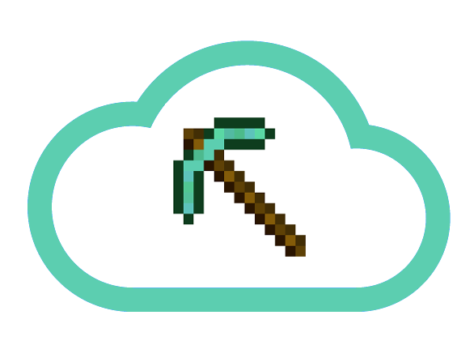

# Miner

[](https://travis-ci.org/Skarlso/js-miner)



[](https://nodei.co/npm/js-miner/)

Miner is a CLI utility to manage multiple Minecraft servers with simple commands and Docker Containers to keep them isolated.

Further more it provides the ability to backup any world to a configured S3 bucket.

Simple commands are `attach`, `create`, `start`, `stop`, `backup`.

In the works: `list`, `status`.

Also provides versions of Minecraft with `Bukkit` and pre-configured environment through created Docker Images which are
tagged according to the version they provide.

Thus, it's easy to get a server, which uses mods like the ever famous `/home` teleporter
[MyHome](https://mods.curse.com/bukkit-plugins/minecraft/myhome).

# Usage

## Install

In order for this to be globally available, run the following:

```bash
git clone https://github.com/Skarlso/js-miner
cd js-miner
npm link
```

This should install a globally available version of this CLI tool.

## Description

Miner aims to be used as a lightweight server manager. It does that with Docker Containers in order to isolate running servers.
The containers expose port `25655`. The words are located on the local machine though and mounted into the container via Volumes.
This is so, that after a world is created, it will remain and `Plugins` or `Modules` can be used with the world. Once it starts
again the modules will be enabled.

This tool also provides the option to backup a World to a configured S3 bucket. The world is zipped and uploaded using local AWS
credentials located under the AWS CLI credentials file.

js-miner depends on a few environment variables which can be configured.

## Configuration Options

```javascript
config.bucket = process.env.MINER_BUCKET || 'my-minecraft-backup-bucket';
config.defaultName = 'miner_server';
const configDir = os.homedir() + '/.miner_world/';
config.bindBase = process.env.MINER_WORLD_BIND_BASE || configDir;
config.profile = process.env.MINER_AWS_PROFILE || 'default';
config.repoTag = process.env.MINE_CON_BASE || 'skarlso/minecraft:'
```

* `MINER_BUCKET` specifies the bucket in which the miner backs up the world
* `defaultName` is the name of the world if no name is provided (it might be obsolete)
* `bindBase` is the folder to use for the containers to bind their volume into. This is the location where your worlds will be located at.
This one is important to remember, because you are going to have to interact with these worlds, as they contain the plugins and settings for
any given server. This is how worlds/plugins/settings/mods are persisted for servers.
* `profile` aws is configured using the AWS credential file. If you have a different profile you would like to use with js-miner than the
default one, please set this environment property.
* `repoTag` if you don't want wait for me to push new versions up Docker, you can use your Own container. The only requirement is that there is a `/data` folder and a `/minecraft` folder. In `/minecraft` there are two files: `forge.jar`, `craftbukkit.jar` and `minecraft_server.jar`. Although I'm not a 100% sure if that is a requirement by either modding solutions.

## LifeCycle

So what is a typical usage cycle for js-miner?

### Setup

You begin by setting up a given version you would like to use. At this stage, both, `forge` and `craftbukkit` are an option.
Run the following command to pull the required image for your server and setup the `world_name.version` file which contains information
about what version the server will use. Do this by running `setup`:

```bash
js-miner setup -m 1.11.2 -n new_world
```

### Start

This is where you define what mod miner should use to generate your world. By default it will use `craftbukkit`. You can override this by
setting the environment property `MINER_MOD` to `forge`.

In order to actually generate a world run the following:

```bash
js-miner start -n new_world
```

At this point, you have an un-altered, vanilla version of the world with default settings.

#### Own World / Edit options

If you have to edit something, or have your own world you would like to use, or alter some setting, first, stop the world.

```bash
js-miner stop -n new_world
```

This saves the world and stops the container. Now, navigate to the world folder located under `$MINER_WORLD_BIND_BASE/.mine_world/new_world`
and add plugins to the mod/plugin folder like [MineColonies](http://www.minecolonies.com/tutorial), or edit the server settings, or copy over a whole different world like [Coarse Sands](http://www.minecraftmaps.com/survival-maps/coarse-sands).

Once done, you can start the world again and new settings will be available to you.

### Stop

When done using the world, save and stop it by issuing the stop command again:

```bash
js-miner stop -n new_world
```

This also sends a `stop` to the Minecraft server which will save the current version of the world.

### Backup

Backup frequently if you tend to mess up everything by running the following:

```bash
js-miner backup -n new_world
```

This will zip and timestamp your world and upload to the S3 bucket defined in your settings.

### Attach

It's possible to attach to a running server if one wants to run some commands like, /op, or /give from the server.

To attach to a running world simply run:

```bash
js-miner attach -n new_world
```

You can start typing away your commands to the server.

## Mods

Both, craftbukkit and forge are supported mods and come with the server pre-configured. For forge, the installed mod goes into the `mod` folder of the world for craftbukkit, it goes into the plugin folder. If the server is started with Forge mods, the mods need to be present on the client side as well.

Luckily, forge install is now very easy, and has a gui. You can install the client easily and just copy the ZIP file into your mod folder located under your minecraft install folder. For OSX this is: `/Users/user/Library/Application Support/minecraft/mods`.

To choose Forge mod, run a server like this:

```bash
MINER_MOD=forge js-miner start -n lucky_world
```

## Versions

Versions are built by me and hosted under [MineCraft Docker](https://hub.docker.com/r/skarlso/minecraft/). There are only three
versions currently, but once all the features are working properly, I'll build more. Forge is only provided on 1.11.2 right now.

As new versions will come out, I will update these containers to contain them as well.

# Contributions

They are welcomed.
